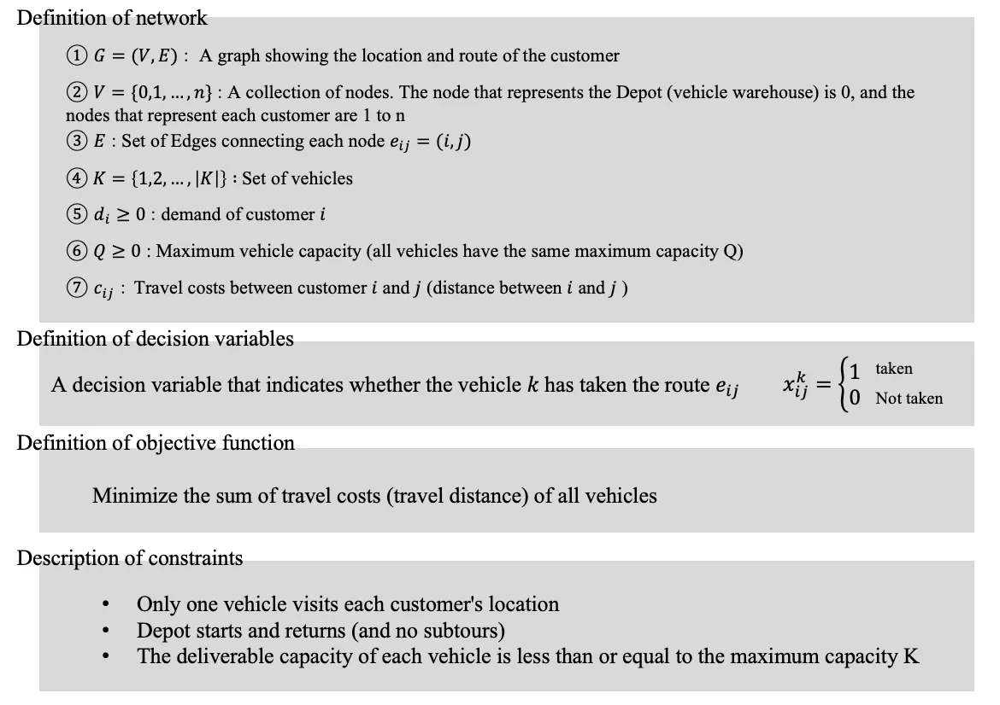
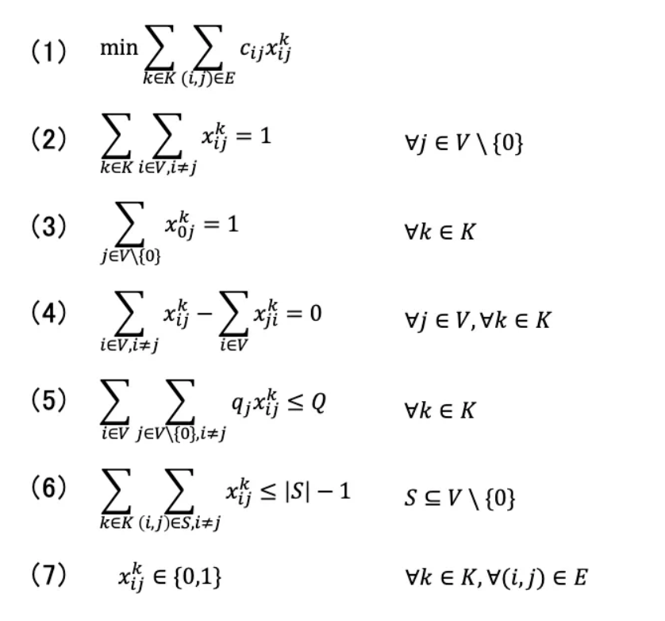
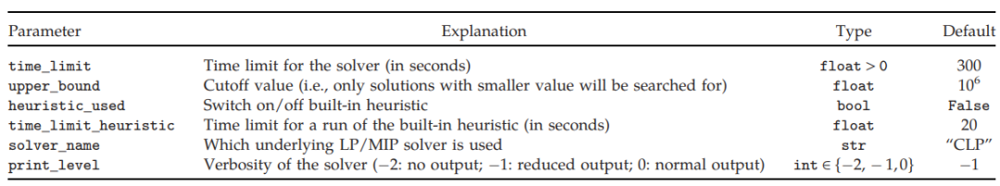
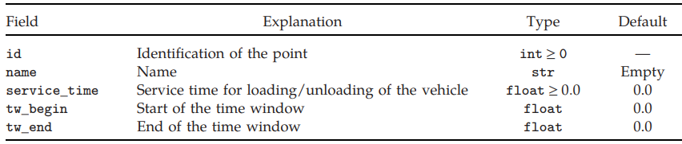
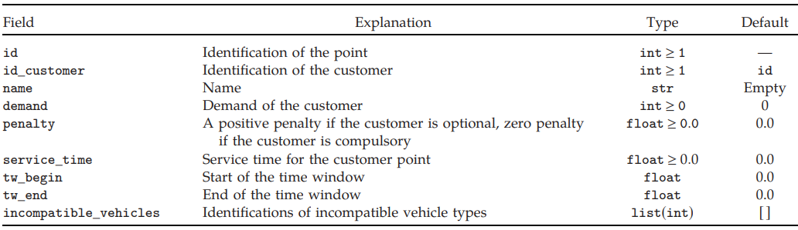
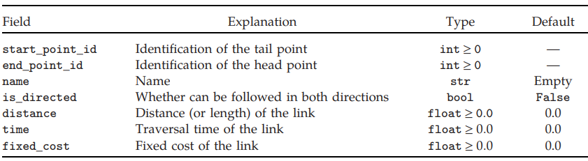
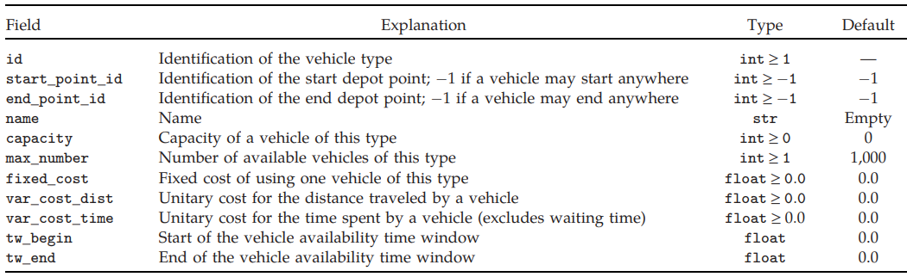
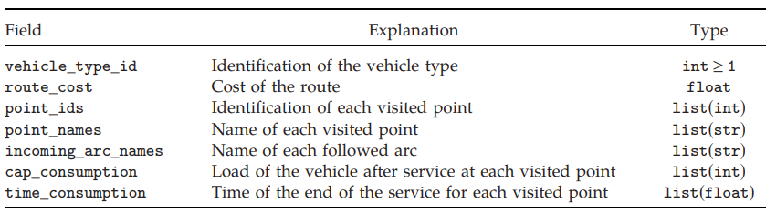

# 1. Vehicle Routing Problem and CVRP
1. objective: minimize the total route cost
   1. cost maybe monetary, distance or otherwise
2. constraint:
   1. one route for each vehicle that must start and finish at its own depot
   2. customers' requirements 
   3. operational constraints
3. use graph describe the road network 
   1. directed or undirected graph: possible presence of one way streets or different costs in each direction
   2. the vertices are the customers and depot, arcs are rge roads between them
   3. Each arc has an associated cost (travel time, length....)
   4. the cost of shortest path from i to j: $C_{ij}$
   5. the travel times of the arcs on the shortest path from i to j: $t_{ij}$
4. Priority and penalty
   1. Sometimes it is impossible to satisfy all of a customer's demands and in such cases solvers may reduce some customers' demands or leave some customers unserved.
   2. To deal with these situations a priority variable for each customer can be introduced or associated penalties for the partial or lack of service for each customer given
5. Main solution methods
   1. Vehicle flow formulations
   2. Commodity flow formulations
   3. Set partitioning problem

# 2. CVRP (Capacitated Vehicle Routing Problem) 
1. Vehicles have a limited carrying capacity of the goods that must be delivered.
2. The items have a quantity, such as weight or volume, and each vehicle has a maximum capacity that they can carry.
3. objective: pick up or deliver the item with the least cost
4. constraint: capacity of the vehicles
5. Model:
   1. assigning ‘1’ to an edge means that a route is being selected
   2.  
   3.  
# 3. pyVRP
1. details in code
# 4. VRPSolver
1. create model：`VRPSolverEasy.Model()`
2. model's properties:
   1. we could set model properties like this: `model.<property name>`
   2. `max_total_vehicles_number`：the maximum total vehicles number
3. set parameters:`model.set_parameters(time_limit=300,upper_bound=1000000,heuristic_used=False, time_limit_heuristic=20,solver_name='CLP',print_level=-1,  action='solve')` 
   1. solver_name : [CLP,CPLEX]
   2. action : [solve,enumAllFeasibleRoutes]
4. add points：
   1. depots: `model.add_depot(id,name='',service_time=0.0,tw_begin=0.0,tw_end=0.0))` 
   2. customers: `model.add_customer(id,id_customer=,name='',demand=0,penalty=0.0,service_time=0.0,tw_begin=0.0,tw_end=0.0,incompatible_vehicles=[])` 
   3. points: `add_point(id, name='', id_customer=0, service_time=0.0, penalty_or_cost=0.0, tw_begin=0.0, tw_end=0.0, demand=0, incompatible_vehicles=[])`
      1. Add a point to th graph
      2.  if we want to add Depot, id_customer must be equal to 0, otherwise it cannot be greater than 1022 for a Customer
5. add link:`add_link(start_point_id=0, end_point_id=0, name='', is_directed=False, distance=0.0, time=0.0, fixed_cost=0.0)` 
6. add vehicle type:`model.add_vehicle_type(id,start_point_id=-1,end_point_id=-1,name='',capacity=0,fixed_cost=0.0,var_cost_dist=0.0,var_cost_time=0.0,max_number=1,tw_begin=0.0,tw_end=0.0)` 
7. Solve:`model.solve()`
8. Route:
   1. Define a route from solution
   2. properties:  

# 5. Result
1. VRPSolver is significantly faster than pyVRP. While VRPSolver only takes 0.1 seconds, pyVRP requires 2480 seconds.
# reference:
1. https://medium.com/jdsc-tech-blog/capacitated-vehicle-routing-problem-cvrp-with-python-pulp-and-google-maps-api-5a42dbb594c0
2. https://github.com/Valdecy/pyVRP?tab=readme-ov-file
3. https://en.wikipedia.org/wiki/Vehicle_routing_problem