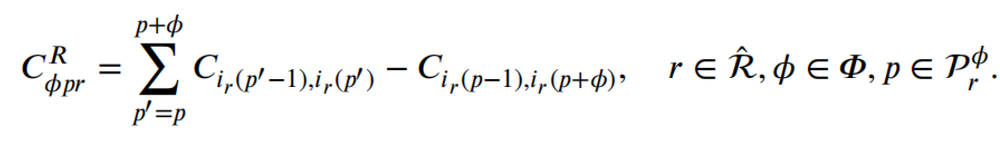
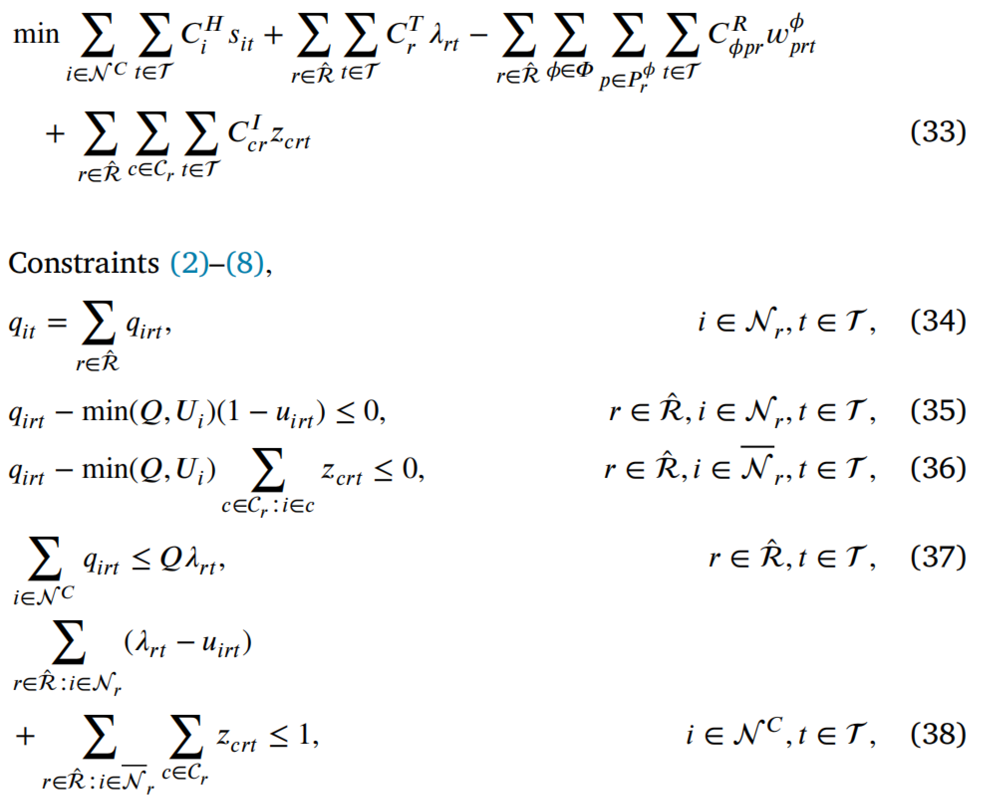

# 1. Introduction
1. Alg for IRP but also imporvement in CVRP and SDVRP(split delivery vehicle routing problem)
2. CRVP limits each customer to be served by one vehicle while the SDVRP allows multiple visits to each customer
3. IRP: dynamical decision of when to visit each customer
4. Guimarães et al. (2023) proposed new mechanisms to improve IRP solution with both exact methods and heuristics
5. BP&C(Branch-and-price) tree get good dual bounds
6. Vadseth et al.(2021) introduce a matheuristic that iteratively solves a route-based MLIP, with bestaverage alg
7.  Alvarez et al.(2020) can produce good solutions for IRP in a very short time
8.  Model: 
    1. depot: i == 0
    2. $S_t$: unit of the product are produced at the supplier
    3. customer $i \in N^C$
    4. time period $t \in \Tau$
    5. $D_{it}$: customer i's demand of a single product at time period t
    6. V: the number of vehicles in the same type
    7. $L_i$ and $U_i$: lower and upper inventory level of node i 
    8. $I_i$: initial inventory level of each node i at beginning of the first time period
    9. $I_{it} = \max{(I_i - \sum^t_{s=0}{D_{is}}, 0)}$: the inventory that is left from the initial inventory at customer $i \in N^C$ in time period $t \in \Tau$
    10. G = (N,A): graph; N is all nodes, A is all arc
    11. $C_{ij}$: cost from i to j
    12. $C^H_i$: the unit inventory holding cost of node $i \in N$
    13. $x_{ij}$: binary variable. Equals to 1 if arc(i,j) $\in A$ is traversed in time period $t \in \Tau$ and 0 otherwise
    14. $s_{it}$: inventory level at the depot or a customer $i \in N$ at the end of time period $t \in \Tau$
    15. $\sigma_{it}$: equals to 1 if customer i is visited in time period $t \in \Tau$ and 0 otherwise
    16. $\sigma_{0t}$: the number of vehicles that leave the depot in time period t
    17. $q_{it}$: the delivered quantity to customer i in time period t
    18. Q: each vehicles' capacity

# 2. The branch-and-cut embedded matheuristic
1. overview:  
2. Construction heuristic
   1. create a small set of promising routes $\hat{R}$ and solve a MILP to select a subset of these routes that form a feasible solution to the IRP
   2. Dantzig–Wolfe reformulation
      1. $A_{ijr}$ is 1 if route r traverses the arc $(i,j) \in A$ and 0 otherwise
      2. $\lambda_{rt}$ = 1 if route $r \in \hat{R}$ is used by a vehicle in time period $t \in \Tau$; otherwise, equals to 0
      3. $l_{ijt}$ the quantity loaded on a vehicle traversing arc $(i,j) \in A$ in time $t \in \Tau$ 
      4. strenthen the linear relaxation
         1. a fact: There has to be at least one visit to a customer in time periods $\{t_1,...,t_2\} \in \Tau$ if the sum of the demands in time period $t_1$ to $t_2$ is greater than the maximum inventory limit:  
         2. further strengthened:  
            1. maximum inventory heal at a node at the beginning of time t is $U_i - D_{i(t-1)}$
            2. if $t_1 = 1$, replace $U_i - D_{i(t_1-1)}$ in (28) and $s_{i(t_1-1)}$ in (29) with $I_i$
   3. route generation: get feasible solution
      1. giant tour method: from Vadseth et al.(2021)
         1. Each custiner in the giant tour is assigned a delivered quantity equal to a predefined percentage P of its inventory capacity.
         2. The giant tour with these corresponding delivered quantities is then converted to a capacitated vehicle routing problem (CVRP) solution
         3. The routes of the CVRP solutions are added to $\hat{R}$
      2. shifting assignment method 
         1. $\hat{q}_{it}$: the quantity to deliver to customer i in the time period t
         2. $f_{vt}$: the load onboard vehicle v in the time period t
         3. $v_{it}$: store the index of the vehicle serving the customer in time period t; index of 0 indicating that the customer is not served in that time period
         4. $\Kappa = \{1,...,V\}$ as the set of vehicles
         5. Meaning of alg
            1. initial part
               1. line2: If invetory satisfy demand, set q = 0; otherwise, set q = $D_{it} - I_{it}$
               2. lien3~6: choose vehicle to load $\hat{q}_{it}$. We will choose the lowest load vehicle $v_{it}$ in each loop and then update this vehicle load condition
               3. we need to ensure: $\hat{q}_{it} \leq Q$, $f_{vt} \leq Q$, $v \in \Kappa$, $i \in N^C$, $t \in \Tau$. If this is not the case, Alg 1 will terminate and no CVRP instance are solved
            2. shifting assignment part: shift delivery quantities from time period t to time period t-1
               1. line8: if at least 1 vehicle depats in previous time period ($\sum_{v \in \Kappa}f_{v(t-1)} \neq 0$), do the loop;
               2. line9~12: if the customer i is not serviced in the previous time period, the quantity $\hat{q}_{it}$ is added to the vehicle with the largest load that can fit the quantity
               3. line 13~14: if the customer i is serviced in the previous time period, add the quantity $\hat{q}_{it}$ to the load if capacity allowed
               4. line 15~18: shift quantity from time t to t-1
            3. CVRP:
               1. solve CVRP instance for each time period t with delivery quantities $\hat{q}_{it}$
               2. CVRP instance in time period t, only customers with $\hat{q}_{it} > 0$ are included
3. improvement heuristic
   1.  
   2. $IT_n$：upper limit on the number of iterations. We could set it with any number
   3. VRP：
      1. takes a feasible solution x as input and solves three CVRP instances for each time period $t \in \Tau$
      2. the demand of each customer is set equal to its delivered quantity in time period t
      3. the vehicle capacity 𝑄 is set differently in the three instances: 
         1. By varying the vehicle capacity 𝑄, we mimic the effect of shifting quantities between time periods and are hopefully able to find better routes
         2. capacity: multiplying Q with 0.97, 1.03, 1.06
   4. ImprovementMILP($\hat{R}$)
      1. choose customer to insert route
         1. $N_r$： the customers visited on route $r \in \hat{R}$
         2. $\bar{N}_r$：complement set of $N_r$
         3. C: a cluster of customer could be chosen to insert route $r$. 
         4. c: a subset of customer. $c \in C$
         5. $C_r = \{c \in C | c \cap N_r = \empty\}$
         6. $z_{crt}$: binary varibale. 1 if cluster c chosen to insert route r and 0 otherwise
      2. insert position：$p^*_r(c)$ 
         1. depot position：0 and $|N_r|+1$ in route $r$
         2. $i_r(p)$：the node at position p in route r
         3. $C^{SP}(i_{start}, c, i_{end})$：a cost of shortest path from node $i_start$ to $i_end$ through all customer in cluster c 
      3.  To add cluster $c \in C_r$, the cost increases: 
      4.  example： 
          1.  original route r: $0 \rightarrow a \rightarrow d \rightarrow e \rightarrow 0$
          2.  cluster $\tilde{c} =\{b,c\}$
          3.  the cheapest position is 2
      5.  Use k-means to produce cluster
          1.  $k = \lfloor |N^C|/2 \rfloor$, if the produced cluster c' size in the range : $[2, ..., clusterSize]$, the cluster will be put in the set $C^k$. This paper set clusterSize = 3
          2.   
      6.  removing customer from a route
          1.  M: maimum number of consecutive customers that can be removed and hence define the set $\Phi = \{1,..., M\}$
          2.  $w_{prt}^{\phi}$: binary variable. 1 if $\phi \in \Phi$ cpnsecutive customer are removed from route $r\in R$ starting from position $p \in P_r^{\phi}$ in time period $t \in \Tau$ and 0 otherwise
          3.  $P^{\phi}_r$ contains all position p in route r in time period $t \in \Tau$
          4.  $u_{irt}$: binary. 1 if node $i \in N$ is removed from route r and 0 otherwise
          5.  The cost reduction of removeing $\phi$ customers from route r starting at position p:  
          6.  if a cluster consisting of a single customer (𝑒) is added to a route and a sequence of three consecutive customers (𝜙 = 3) starting from position 𝑝 = 1 are removed from the same route.  
      7.  Improvement MILP:       
          1.  $q_{irt}$: the quantity delivered by route r to node i in time period t
          2.  $u_{irt}$: in sequence 𝜙 starting at position 𝑝 are set to 1
          3.  "1" in constraint 35, 42, 49, 50 could be replaced by $\lambda_{rt}$ to tighten the constraints
4. Branch-and-cut method
   1. CS(customer schedule) formulation:  Skålnes et al.(2022)
      1. a polyhedron defined by the linear relaxation of constratins: 3,5,7,8,10,15,16. We describe a bounded set of feasible solutions $P_i$ 
      2. $\Omega_i$ is the set of extreme points of the convex hull of $P_i$
      3. for each extreme point $\omega \in \Omega_i$ as a customer schedule for customer $i \in N^C$
         1. customer schedule: a set of days the customer is visited and the quantity delivered on each of these days
         2. $y_{i\omega}$: weighting variables the use of customer schedule $\omega$ for customer i
         3. $B_{it\omega}$: binary. 1 if customer i is visited in time period t by using customer schedule $\omega$, and 0 otherwise
         4. $Q_{it\omega}$: the delivered quantity to customer i in time period t by using customer schedule $\omega$
         5. $S_{it\omega}$:  the inventory level at customer 𝑖 in time period t if customer schedule $\omega$ is used
      4. MILP: 
         1. refinement: substituting the euqality sign of constraints 53 with a $\geq$ sign 
   2. A priori generation of customer schedules
      1. L is a set of label which store lower and upper bounds on the inventory levels for each time period for node i
      2. $L_0$: the initial values of the inventory bounds. The bounds will be set as:
         1. upper bound: $\bar{s}_{it}(L) = \min{\{I_i + \sum_{t' = 1}^t (\min{\{\bar{L}_i, Q\}} - D_{it'}), \bar{L}_i\}}$  ($\bar{L}_i$ is the upper inventory level)
         2. lower bound: $\underline{s}_{it}(L) = \max{\{I_i - \sum_{t' =1}^tD_{it'}, 0\}}$
      3. U: refers a set of unprocessed labels
      4. P: completed labels
      5. function f: 
      6.  
         1. line3: selects one label from the set of unprocessed labels
         2. line4,5: If the lower and upper inventory bounds are equal for each time period, add the selected label L to P
         3. Once the inventory bounds are updated a new period $t$ where $\bar{s}_{it} \neq \underline{s}_{it}$
         4. If a label in L will lead $\underline{s}_{it}(L) > \bar{s}_{it}(L)$ for any time, the label will be discard
   3. BC method:
      1. use the solution from improvement heuristic to warm start the BC method
      2. iteratively separate and add violated subtour elimination constraints and valid inequalities
      3. separation order: 
         1. the latter three classed of valid inequalities:
            1. (iii): $\sum_{(i,j,t) \in A_u} x_{ijt} \geq \lceil \sum_{(i,t) \in U}\bar{D}_{it}/Q \rceil$
               1. residual demand(the demand that cannot be covered by the initial inventory): $\bar{D}_{it} = \max{\{D_{it} - I_{it}, 0\}}$
               2. $RD = \{(i,t) \in N^c \times \tau | \bar{D}_{it} > 0\}$: all positive residual demands across all customers and time periods. $U \subseteq RD$
               3. $P^{-}_{jt} = \{(i,j,m) \in N \times N^C \times \Tau | (\bar{D}_{jt} > 0 \bigwedge m \leq t \bigwedge (\sum_{l=m}^t\bar{D}_{jl} + I_{jm} \leq \bar{L}_j))\}$: refers all arcs which serve residual demand$\bar{D}_{jt}$
               4. $A_u = \{(i,j,m) \in P^{-}_{jt} | (j,t) \in U\}$
            2. Avella et al.(2018)
               1. Given a subset $S \subseteq N^C$ and coefficients $\mu_{ij} \geq 0$ for all arc $(i,j)$
               2. (iv): $\sum_{(i,j) \in A}\mu_{ij}x_{ijt} \geq \sum_{j \in S_0 \bigcup S_1} q_{jt} + \sum_{j \in S_2}(q_{jt} - s_{j,t+1}) + \sum_{j \in S_3}(q_{jt} - s_{jt}) + \sum_{j \in S_4}(s_{jt} - (U_i - D^i_{t-1,t}))$
                  1. a partition $(S_0, S_1,S_2, S_3,S_4) of S$
                  2. $v^i = Q$ for $i \in S_0$
                  3. $v^i = U_t^i$ for $i \in S_1$: $U_t^i = U_i - D_{it}$ is upper inventory capacities of customer i at time t, where $U^i$ is upper bound of inventory of customer i
                  4. $v^i = D^i_{t,t+1}$ for $i \in S_2$, where $D^i_{t,t+1} = D^i_t +D^i_{t+1}$
                  5. $v^i = D^i_{t}$ for $i \in S_3$
                  6. $v^i = D^i_{t-1}$ for $i \in S_4$
                  7. $v^i = 0$ for $i \in N^C \bigcup \{0\}$
                  8. $\mu_{ij} = \min {(Q - v^i, v^j)}$ for all arc $(i,j)$
               3. (v): 
                  1. a partition $(S_1,S_2, S_3,S_4) of S$
                  2. $\Pi_h$ is the set of routes R starting and ending at the depot with $|V(R)| = k \leq h$, where $V(R)$ is the set of node $i \in N^C$ where node i is on the route R
                  3. let $N_0 = N^C \bigcup \{0\}$ 

            3. only separate these in the root node
         2. After stage (ii), we only move on to separate the next class of valid inequalities if the dual bound improvement from the previous iteration falls below a given threshold
         3. How to seperation these inequality
            1. (i): 
               1. S is a set of subset of $N^C$
               2. if $S \leq |N^C|/2$ 
               3. else:  
            2. (ii)
               1. if $S \leq |N^C|/2$ 
               2. else:  
            3. (iii)  
            4. (iv): the quadratic 0-1 separation problem for the simple DR inequalities
               1. objective function: $\min \{\sum_{(i,j) \in A} \sum_{k=0}^5 \sum_{l= 0 }^5 \min (Q - v_k^i, v_l^i)\bar{x}_{ij}a_k^ia_l^i - \sum_{j \in N^C \bigcup \{0\}} \bar{q}_{jt}(a_0^j+a_1^j) - \sum_{j \in N^C \bigcup \{0\}} (\bar{q}_{jt} - \bar{s}_{j,t+1})a_2^j - \sum_{j \in N^C \bigcup \{0\}} (\bar{q}_{jt} - \bar{s}_{j,t+1})a_3^j - \sum_{j \in N^C \bigcup \{0\}} (\bar{s}_{jt} - (U_i - D^j_{t-1,t}))a_4^j \}$
                  1. $S_5 = \{i \in N^C \bigcup \{0\}\} \backslash S$ with $v^5 = 0$
                  2. $v_k^i$: binary variable when $i \in S_k$
                  3. $\bar{x}$, $\bar{q}$, $\bar{s}$ are current solution 
               2. constriant: 
                  1. $\sum_{k = 0}^5 a_k^j = 1$, where $j \in N^C \bigcup \{0\}$
                  2. $a_{k}^i$: binary variale, 1 if $i \in S_k$
            5. (v):
               1. case 1: S and partition are given
                  1. sub problem 
                  2. if $|S_1| \geq 20$, use follow procedure to overcome huge number of constraint which on the picture with red mark 
                     1. choose the $\bar{x}_{ijt}$ with maximum reduced cost in the IRP relaxation
                     2. to choose the set S and its partition, we take the partition obtained by solving the quadratic 0-1 separation problem for the simple DR inequalities presented in (iv)
               2. case 2: $S_2, S_3, S_4$ are empty, $S=S_1$ 
                  1. $a^i$: 1 if $i \in S=S_1$ and 0 otherwise

# 3. Paramters
1. Improvement heuristic
   1. k-value: $|N^C|/2$
   2. M = 3
   3. clustersize =3
   4. $IT_1 = 4, IT_2 = 5$
2. separation order:
   1. (v):
      1. h=7 for $|N^C| \geq 35$
      2. h=6 for $|N^C| \geq 50$
      3. h=5 for $|N^C| \geq 200$