# 1. Introduction
1. IRP, to make plans for a limited number of periods in the near future (planning horizon) and to implement the decisions only for the current period
2. Rolling horizon strategy: do the decision based on planning horizon and perform everyday
3.  ‘‘end of times’’ effect: 
    1. optimizes short-term costs (the costs from a limited planning horizon), which is not necessarily aligned with long-term cost reduction.
    2. they(short-term) work with a limited planning horizon, generally ignoring costs occurring beyond this point.
4. DSIRP(Dynamic and Stochastic Inventory Routing Problem): we can have a clear idea of the expected demands for the near future, but the uncertainty grows as we look further ahead.

# 2. Problem statement
1. Based on DSIRP
2. one depot; numerous customers for a specific product; each customer experiences a random demand for the product; a fleet of homogeneous vehicles
3. Parameter: 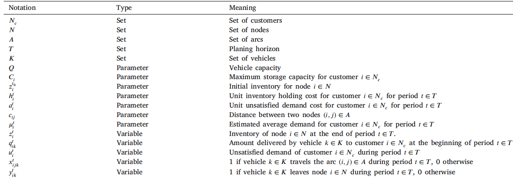
   1. Node:
      1. node 0: depot
      2. $N_c$ = $N/\{0\}$
   2. cost:
      1. routng cost on arc(i,j): $c_{ij}$
      2. cost of holding inventory: at depot, $h_0^t$; at customer, $h_i^t$
      3. lost cost: if demand of node i > available inventory in t, some sales are lost at a unit cost of $a_i^t$
   3.  demand
       1.  stochastic demand: $d_i^t$, with probability distribution with mean $\mu_i^t$, std $\sigma_i^t$
   4.  fleet:
       1.  set K
       2.  capacity: Q
   5.  inventory storage:
       1.  customer inverntory storage capacity: $C_i$
       2.  supplier: infinity
           1.  supplier receives an amount $r^t$ of the commodity at the start of each time period t
   6.  decision us the information of a small time periods $t \in T \subseteq \tilde{T}$
       1.  each period, suppiler looks at inventory level and decides which customer to visit, and the amount of commodity to deliver
       2.   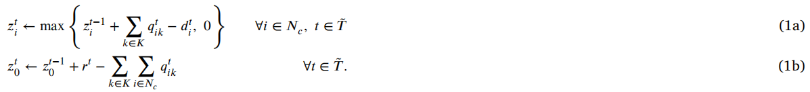
           1.  $z_i^t$: customer i's inventory level at the end of period t
           2.   $z_0^t$: depot's inventory level at t
           3.   $q_{ik}^t$: amount of product delivered to customer $i \in N_c$ in vehicle $k \in K$ during period t
           4.   $d_i^t(\epsilon_i^t)$: demand of node i in time t
       3.  To solve this problem, we could use iteration
4.  Problem iteration: 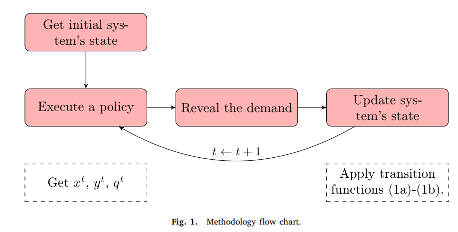
   1.  decide routing and deliver quantity at period t by the system state : $S_t = (z_0^{t-1},...,z_n^{t-1})$
   2.  total cost 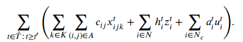 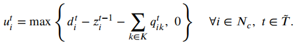
       1.  $t'$ represents the period in which the average operational cost tends to tabilize. This threshold was used to eliminate the transient phase of the simulation in the computation of long term costs
   3.  Alg 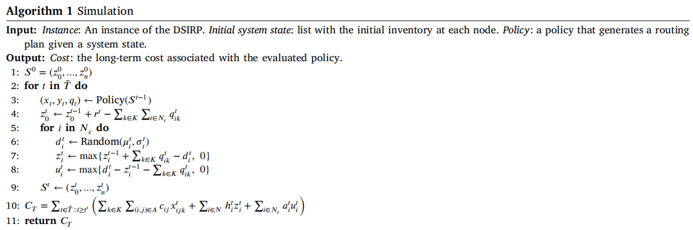

# 3. Methods
1. We conside that the supplier is at $t_0$ and maske a schedule for periods $t \in T = \{t_0+1,...,t_0+b\}$ but only $t_0 + 1$ will be execute. The suppiler konws $\mu_i^t$ for every customer $i \in N_c$ for the periods $t \in T$
2. Baisc IRP 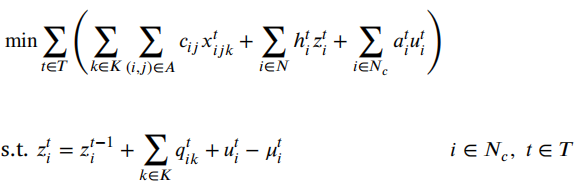 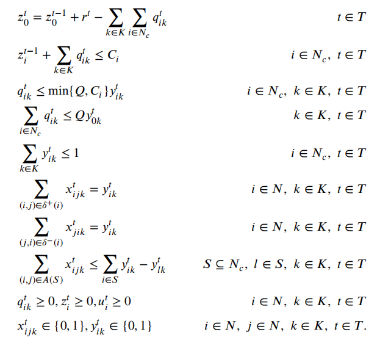 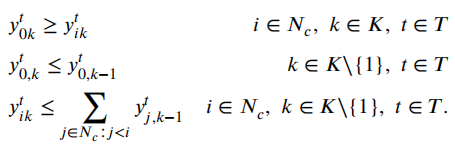
3. simple modified:
   1. modification
      1. final inventory: imposing a minimum inventory for each customer at the end of the planning horizon
      2. Safety stock: imposing a safety stock for each customer throughout the planning horizon
      3. Artificial discount rate: using an artificial discount rate in the objective function.
   2. Final inventory
      1. To avoid carrying out successive planning that leaves customers without inventory at the end of the planning horizon, we incorporate a constraint that ensures, for each customer, a minimum level of inventory at the end of the planning horizon.
      2.  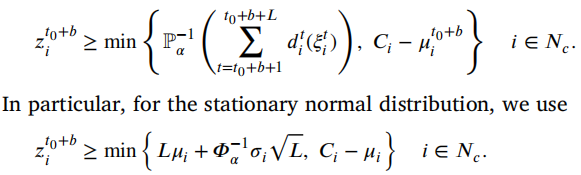
         1.  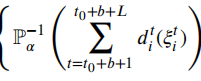: the quantile 𝛼 of the probability distribution function associated with the sum of demands in the next period
         2. $C_i - \mu_i^{t_0+b}$: the maximum inventory that node i can store at the end of period $t_0+b$
   3. Safety stock:
      1.  prevents stockouts at each warehouse and period with a level of confidence 𝛼.With safety stocks, we ensure with probability 𝛼 that we have enough stock to meet the demand for each period.
      2.   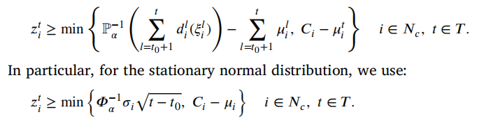
          1.   In the modeling, we considered that at the end of each period, the average demand between periods $t_{0} + 1$ and t must have been satisfied
   4. Artificial discount rate:
      1. This forces the model to focus on optimizing the more immediate periods.
      2. new objective: 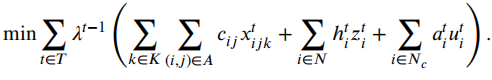
4. Local search heuristic:
   1. initial solution:
      1. every customer is visited the day before their inventory levels would violate their safety stock. Customers are restocked to their capacity each time they are visited
      2. assign vehicle to them. If we don't have vehicles with enough capacity, choose the least loaded one and we will update the route after. 
   2. local search:
      1. a visited customer is removed from a route and then reinserted in every position of every route. W choose the best one
   3. feasibility: reduce deliveries so fit in the vehicle
   4. allow to violate safe stocks but get penalty
5. 2-stage IRP:
   1.  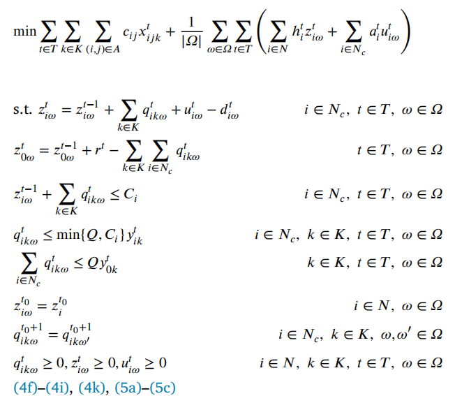
   2. first stage: assignment and routing variables for each $t \in T = \{t_0+1, ..., t_0+b\}$
   3. second stage: accodring to the scenario $\Omega$, we can konw the final cost.  (scenario, 2 stage with sampling size $|\Sigma| \in \{10,30\}$ in the 5.3.2) 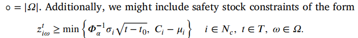

# 4. IRP with relaxed periods
1. The planing horizon T is partition into 2 disjoint subsets $T_E$ and $T_A$, where $T_E$ preceds $T_A$
   1. in the period $T_E$, we designer route as former
   2. in $T_A$, costs are approximated using the linear relaxation.
2. objective:  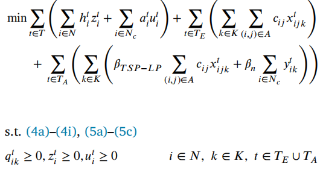 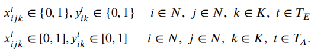
   1. in $T_A$, the routing cost for each vehicle is approximated by a linear combination of the optimal value of a linear relaxation of the TSP and the number of customers on the route with 2 beta parameters
   2. So, we don't need to know the precise routes of the solution, because we only conerns their cost
   3. x and y in $T_A$ is the continuous variables, not integer variables
   4. problem: How to split T? How to decide $\beta$?
3. optimized IRP-RP
   1. the constraint will lead to slow because the high number of combination: 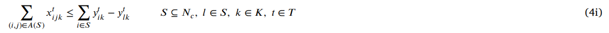
   2. drop constraint for $t \in T_A$ in 3 different TSP model
      1. $R_{MTZ}$ (Miller–Tucker–Zemlin) 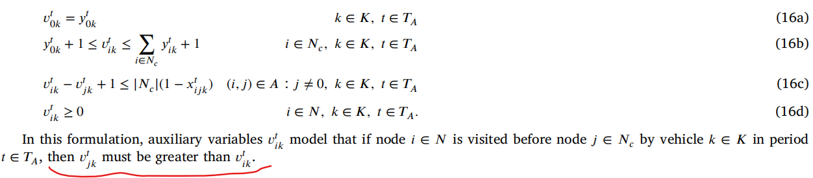 
      2. $R_{SCF}$ (Single Commodity Flow) 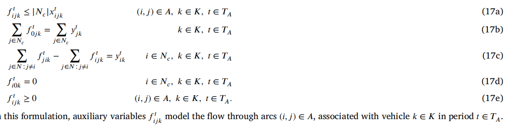 
      3. $R_{MCF}$ (Multi Commodity Flow) 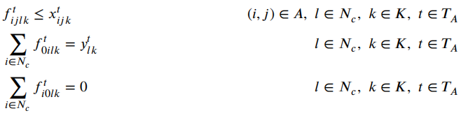 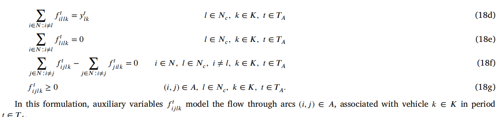
   3.  How to get $\beta$
       1.  For each instance, randomly generate subsets of customers $N'_c = \subseteq N_c$ and solve both an exact TSP and LP.
       2.  regression to get $\beta$ 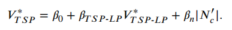
4.  use branch-and-cut algorithm to solve short-term IRP
    1. Alvarez et al. (2021)
    2. each time an integer solution is found we define a directed graph $\hat{G}_k^t = (\hat{N}_k^t, \hat{A}_k^t)$, where $\hat{N}_k^t = \{0\} \cup \{i \in N_C: \hat{y}_{ik}^t = 1\}$ and $\hat{A}_k^t = \{(i,j) \in A: \hat{x}^t_{ijk} = 1\}$
    3. for each graph, we should find a set S disconnected from depot, we add constraint (4i) with $l = \arg \max_{i \in S} \{\hat{y}^t_{ik}\}$ for all vehicle $k \in K$ and period $t \in T$

# 5. Experiement
1. index: 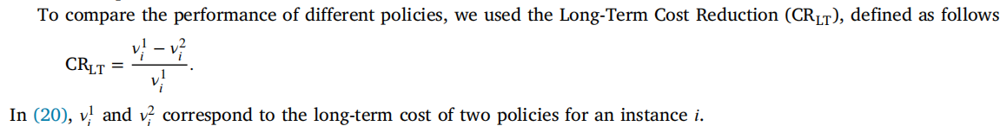
2. some marks:
   1. IRP(b): b represents the number of periods in the planning horizon |T|
   2. -FI(L): first inventory policy. L  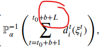
   3. -SS: Safety stock policy
   4. -DR($\lambda$): $\lambda$, discount rate
   5. -TS(o): o = $|\Omega|$
   6. IRP(be)-RP(ba): be, |$T_E$|; ba, |$T_A$|
3. Node: 10; K:3
4. result:
   1. IRP-SS执行最快，改进最好
   2. MTZ and SCF similar but all less than MCF
   3. $T_E$ or $T_A$: 
      1. consider $T_E$ constant, let first approximate period be in $T_A$, we have highest marginal value
      2. increasing $T_E$ and $T_A$ are all can increase savings, but  a leveling off of savings as $T_A$ increases (fig2 and fig3 compare with IRP-SS)
   4. approximate period is an effective method to capture more information using few computational resources
   5. IRP(be)-RP(ba)-SS is the most robust methods
   6. IRP-RP is a better way to speed up while improve result