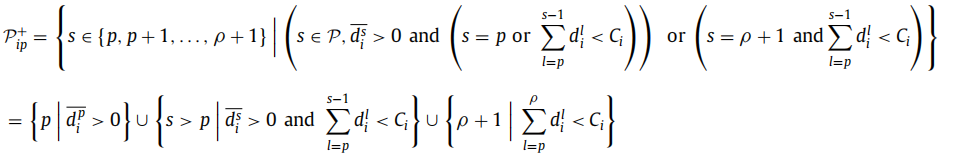
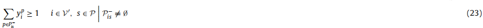

# 1. Problem description
1. In IRPT:
   1. the supplier can deliver goods to the retailers
   2. transshipments between retailers or between the supplier and a retailer are possible
   3. These transshipments are carried out by a subcontractor.
2. Problem:$G=(V,\epsilon)$  
   1. $V' = V \backslash \{0\}$
   2. holding cost: $h_i$
   3. inventory cost:
      1. retailers inventory level $\in [0, C_i]$
      2. suppiler inventory level $\in [0, \infty)$
   4. fleet capacity: Q
   5. time period: $p \in \{1,...,\rho\}$
      1. in each time p, suppiler has $r^p$ products available
      2. in each time p, retailer i get $r_i^p$ products
      3. in each time p, retailer i has $d_i^p$ demands
      4. in each time p, ship $q_i^p$ to each retialer i
      5. in each time p, a vehicle can perform 1 route, beginning and ending at the depot
      6. in each time p, retailer's inventory: $I_i^p$ (calculated at the end of each period after deliveries, transshipments and satisfying the demand)
   6. routing cost: $c_{ij}$
   7. transshipments: 
      1. in each time p, $w_{ij}^p$ was made by subcontractor, number of subcontractor is not limited
      2. $w_{ij}^p > 0$ means the quantity of prodcuts from i to j 
      3. subcontractor can start from depot or a retailer to multiple retailers in the same period
      4. unit cost: $b_{ij}$
   8. policy: maximum level(ML)
      1. the delivered quantities have to respect the minimum and maximum inventory level
   9. $x_{ij}^p$: equal to 1 if retailer j immediately follows retailer i on the route in time p
   10. $x_{0j}^p$: can be 2 because we may have a route only from depot to a retailer and back to depot
   11. $y_{i}^p$: equal to 1 if the depot(i=0) or retailer i is visited in time p

# 2. Improvement of model
1. Introduce 4 improve methods:More valid constraints, improved bounds, Reformulation of the routing component, Elimination of unnecessary variables
2. Nodes can do subdelivery (from Desaulniers et al. (2015))
   1. $I_{i}^{0,s} = \max \{0, I_i - \sum_{l=1}^s d_i^l\}$: quantity remaining from the initial inventory at retailer i at the end of period $s \in P$
   2. residual demands 
   3. $P^+_{ip}$:  
      1. all periods in which a delivery of goods in period p can be used to satisfy demand or for the end inventory
      2. artificial period $\rho + 1$ is introduced to handle the end inventories
      3. $P^-_{is} = \{p \in P | s \in P^+_{ip}\}$:  represents the set of periods at which a subdelivery can be made to fulfill the demand of retailer i at period s
      4.  
         1. we have 6 period long planning horizon ($p \leq 6$)
         2. retailer will need delivery at period 3 when in period 1, so $P^+_{i1} = \{3\}$
         3. a delivery (fullfill the $C_i$) could only satisfy 3 period (75 * 3 = 225)
         4. $P^-_{i3} = \{1,2,3\}$ is the first non-empty set and determines that subdeliveries to satisfy the demand in period three can be made in the first, second or third period. 
3. More valid constraints
   1. Basic(Archetti et al. (2007)): Existing valid inequalities 
      1. 19: ensures that the inequality is valid in case of a direct shipment, when $x_{0i}^p = 2$
      2. 20: determine if the retailer i is visited in period p
      3. 21: guarantees that the supplier is included in the route if any retailer is visited in that period
   2. Minimum number of visits(Coelho and Laporte (2014)) 
      1. determine the minimum number of times the supplier has to visit a retailer i over a period interval [$p_1$, $p_2$]
      2. if $p_1 -1$ can't satisfy the demand at period $p \in [p_1,p_2]$, we need to delivery goods from depot or other retailer
   3. Minimum number of subdeliveries(Desaulniers et al. (2015))
      1.  
         1. $P^-_{is}$: all the periods in which a subdelivery can be made to satisfy the demand in period s
         2. Ignoring the transshipments, at least one subdelivery should be made in one of the periods of $P^-_{is}$
      2. include transshipments into this inequality 
         1. transshipment is later in the period than deliveries and the policy is ML policy.
         2. Thus, retailer's inven tory capacity may temprorarily be exceeded during the period, like fig1(a)
         3. Like 1(b), the period before $P_{i4}^-$ may have a transshipment let this period's inventory is full, so we should include this period as transshipment in inequlity. Or maybe, in the set $P_{i4}^-$, we use transshipment to satisfy the demands period 4
         4. $s-|P_{is}^-|$: Because trasshipments may result in a situation where the inventory at the end of a period is equal to the maximal capacity, one should also include the transshipments done in the period right before the first period of $P_{is}^-$
         5.  
4. improved bounds: rewrite constraints (6) and (7) 
   1. Because the inventory always has initial inventory not 0
   2. $C_i^*$: maximum quantity the can be delivered
   3. $Q^*$: the maximal quantity that can be transported
5. Reformulation of the routing component
   1. current routing component's constraints. These constraints contain the direct shipment from depot to retailer $x_{0j}^p = 2$, we hope to remove parameter 2 in the ineqaulity (19) 
   2. $z_{i}^p$: binary variable. Equal to 1 if the supplier makes a direct shipment to retailer i
   3. new constraints:  
      1. subtour elimination constraint (31) do not change
      2. replace (19) as  
      3. replace (21) as  
6. Elimination of unnecessary variables
   1. Eliminated links: for example, if we have 3 points i,j,k and the j can be passed by when from i to k, we should avoid routing variable $x_{ik}^p$ and only use $x_{ij}^p$ and $x_{jk}^p$   
   2. Eliminated direct shipments: Since transshipments from the supplier to a retailer are allowed, these can be used to replace direct shipments depending on their cost. 
   3. Eliminated transshipments: it is in some cases cheaper to transship from the supplier to a retailer j than to transship from retailer i to retailer j
      1. we could store goods in retailer i and transfer goods from suppiler when j's demands are not satisfied 
      2. when $\bar{d}^p_i > 0$, the initial inventory of retailer i has already been used 
         1. in this case, $b_{0j} \leq b_{ij}$ is always true
      3. when $h_i \leq h_0$, we should check whether total cost(transshipment+inventory cost)is also smaller 
         1. for example, if we let supplier transship goods to j in period4, cost: $3h_{0} + b_{0j}$, while i to j cost: $3h_i + b_{ij}$ 
         2. however, if $h_{0} \leq h_i$, we can't eliminate $w_{ij}$ because we can't ensure $b_{0j} \leq b_{ij}$ is always true
7. Evaluate: 
   1. LIPH3-absn50: 3 time period, node number 50. Light holding cost
   2. HIPH6-absn50: 6 time period, node number 50. High holding cost
   3. OF+EVI:original formulation
   4. NVI: formulation with all new valid inequalities
   5. IB: formulation with improved bound
   6. RORC: formulation with new routing component
   7. EOUV: formulation with elimination of unnecessary variables
   8. MNOV: choose new inequality: minimum number of visists
   9. MNOS: choose new inequality: minimum number of subdeliveries 
   10. value: the linear relaxation value

# 3. experiment
1. 160 instances, 100 of them are solved for 3 time period, other 60 are solved for 6 time period
2. high inventory cost: $h_i \in [0.1,0.5]$
3. low inventory cost: $h_i \in [0.01, 0.05]$
4. transshiment cost peri unit: $0.01c_{ij}$
5. alg: BC alg. Branch on fractional $y_i^p$ variable
6. Intel (R) Core(TM) i7-3770 3.4 GHz and 32.0GB RAM PC.
7. upper time: 43200s
8. Table 6 and table 7
   1. linear relaxation: give us the LP value and the gap with the MIP value are given
   2. solved: tell us in how many instance we test in the group (same node numbers and same time periods)