# 1. Introduction
1. ML may create inconveniences to customers, who might receive visits when their inventory level is still relatively high.
2. New policy: zero-inventory-ordering(ZIO)
   1. a delivery can be made to a retailer only when its inventory level is zero
   2. 2 aims:
      1. reducing inventory cost at customers
      2. reducing the number of visits to customers by forcing a visit only in case it is necessary
3. Why choose ZIO?ML policy may lead a higher inventory cost 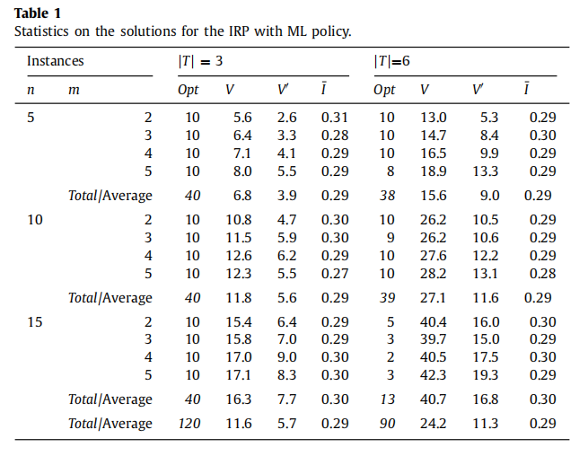
   1. Opt: the instance number
   2. n: nodes number
   3. m: number vehicles
   4. V: average total number of visits to the customers
   5. V': average total number of visits to the customers when the inventory level is greater than 0
   6. $\tilde{I}$: the average inventory level (percentage, current inventory level/maximum level)
4. ZIO is sensitive to the initial inventory level
   1. if the initial inventory is not equal to the sum of demands over some interval of time starting at zero, then no feasible solution exists.
   2. PIRP: To avoid the inventory level equals to 0 at the end of each horizon, we need a constraint: the final inventory level at each customer has to be equal to the inventory level at the beginning of the planning horizon.
5. ZIO-PIRP: ZIO with periodic IRP

# 2. Problem definition
1.  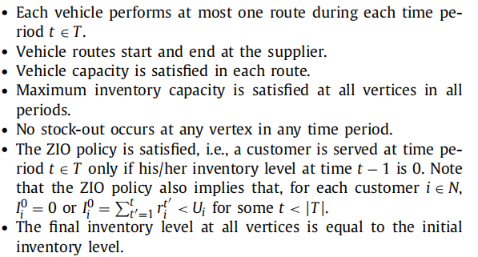
2. formulation: 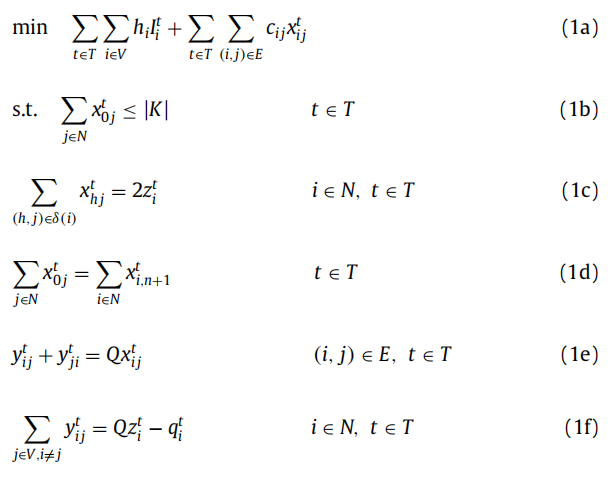 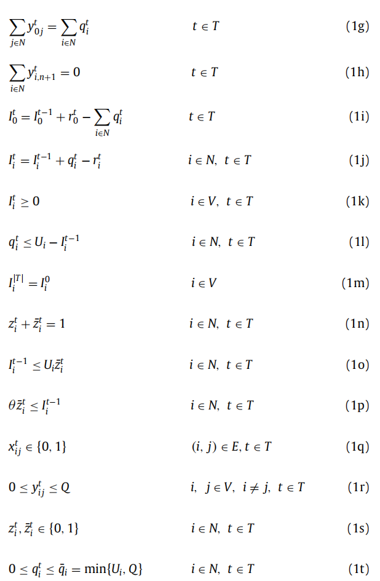 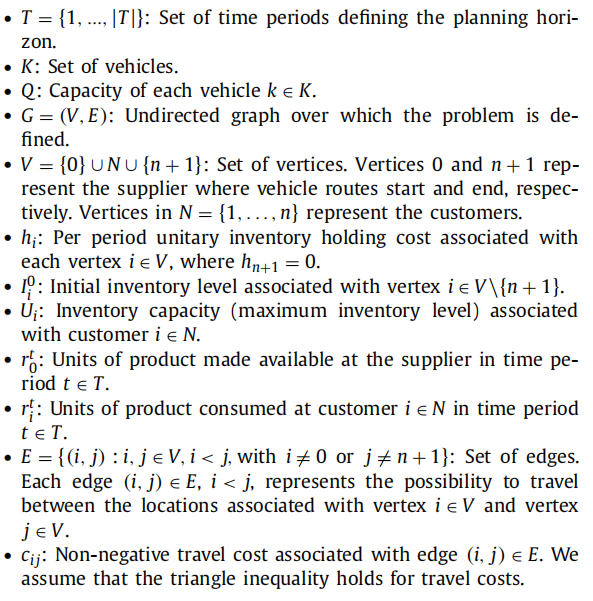 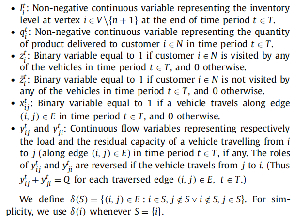
   1. (1b): in each period, the vehicle from depot to customers are not bigger than vechicles' number
   2. (1c): if we visit node i and from the node i to the other nodes, $x_{hi}^t + x_{ij}^t = 2$; otherwise 0.
   3. (1d): fixes the starting and ending point of each route.
   4. (1e), (1f): $y^t_{ij}$: the load when vehicle on the arc ij at t; $y^t_{ji}$, the residual capacity of a vehicle from j to i
   5. (1g): at each period, the vehicles from depot should load enough products to satisfy the customers' demands
   6. (1h): when vehicle return to depot, it's load should be 0
   7. (1m): PIRP
   8. (1p): imposes $\bar{z}_i^t = 0 \rightarrow I_i^{t-1} = 0$ 
      1. $\theta$: 1 if $U_i,Q,I_i^0,r_i^t \in Z^+$ and $0^+$ otherwise
3. strengthen constraints:
   1. logical inequalities: 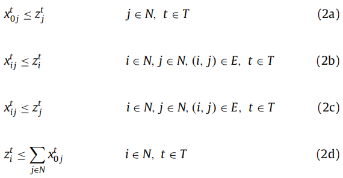
   2. the minimum number of visits to a customer per time interval 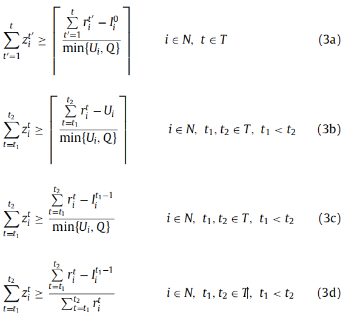
      1. (3a): Consider what is the least frequency for suppiler to visit node i from start to the first time of running out of initial inventory. With the same right-hand side, only the one corresponding to the smallest $t \in T$ is considered.
      2. (3b):  with the same right-hand side, only the one corresponding to the smallest $t_2 \in T$ is considered
      3. (3b) ~ (3d): Consider what is the least frequency for suppiler to visit node i from a given $t_1$ to the given $t_2$
   3. the minimum number of routes per time interval: With the same right-hand side, only the one corresponding to the smallest $t \in T$ is considered 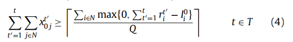
   4. Conditional flow variable bound inequalities: (inverse flow) 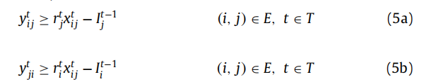
   5. a lower bound on the sum of the regular and inverse flow from a vertex:  This is due to the delivered quantity destined to customer j (regular flow) and the equal amount increase of the residual vehicle capacity after leaving node j 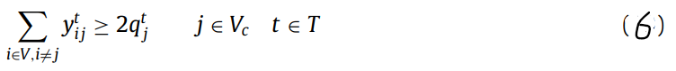
   6. Consistency inequalities 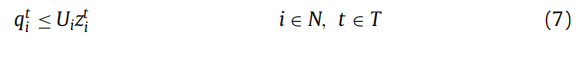
   7. Subtour elimination constraints (improved 1c) 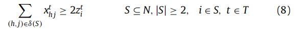
   8. other constraints
      1. when $r_i^t$ is constant, i.e.$r_i^t = r_i$, the following constraints hold 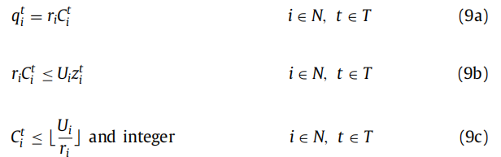
         1. $C_i^t$ is a multiple of $r_i$ to define the quantity delivered to customer i
         2. (9b): (7) + (9a)
      2. when $r_i^t$ is not constant 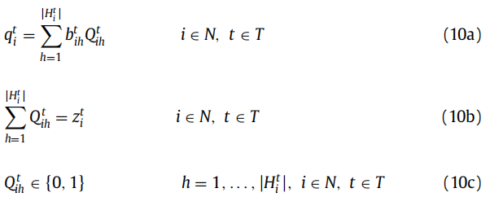 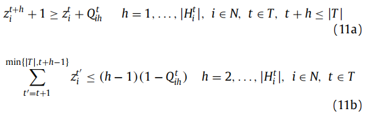
         1. $H_i^t = \{b_{i1}^t, b_{i2}^t,..., b_{i|H_i^t|}^t\}$ is the ordered set of $b_{ih}$ quantities that can be delivered to customer i at t
         2.  $b_{ih} = \sum_{t'=t}^{(t+h-1) mod |T|}r_i^{t'}$ (i.e. $b_{i1}^t = r_i^t$, $b_{i2}^t = r_i^t + r_i^{t+1}$, ...)
         3.  $b_{i|H_i^t|}^t \leq \min \{Q,U_i\}$
         4.  $|H_i^t|$: the first time period for $b_{i,|H_i^t|+1}^t > \min \{Q, U_i\}$
         5.  $Q_{ih}^t$: binart variable. Dfine whether quantity $b_{ih}^t$ is delivered to customer i at t
         6.  (11a): if quantity $b_{ih}^t$ is delivered to customer i in time t ($z_i^t = Q_{ih}^t =1$), then the following visit to the customer has to occur at time t+h ($z_i^{t+h} = 1$)
             1.  since (10b) hold, 11(a) can be rewrite: $z_i^{t+h} \geq Q_{ih}^t$
         7.  (11b): if quantity $b_{ih}^t$ (h $\geq$ 2) is delivered to customer i in time t, then no visit occurs to the customer during time from t+1 to t+h-1. i.e. 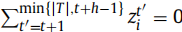

# 3. BC
1. design BC with 2 different formulation 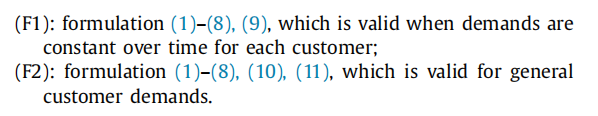
2. BC0: basic formulation (1)-(8)
3. BC1: (F1)
4. BC2: (F2)
5. BC3: F2 without constraints (11)
6. LB': the initial average lower bounds at the node of the tree (the bound obtained before and after the insertion of cuts.)
7. LB'': the final average lower bounds at the node of the tree(the bound obtained before and after the insertion of cuts.)
8. Opt: number of instances in the group solved to optimality
9. Gap: the average optimality gap at termination in percentage
10. inv. cost: inventory cost type
11. Table2: B2 is a better choice for solving problem
12. Table4: 
    1.  Differences are computed by subtracting the average value obtained for the ML policy from the corresponding average value obtained for the ZIO policy.
    2.  Differences are also expressed in percentage with respect to the the average value obtained for the ML policy.
    3.  with ZIO, customer's inventory cost decreased while inventory costs at the supplier and travel costs to increase
    4.  application of the ZIO policy decreases at the increase of relative weight of the inventory costs at the customers.
13. Table7: percentage of each part in ML and ZIO