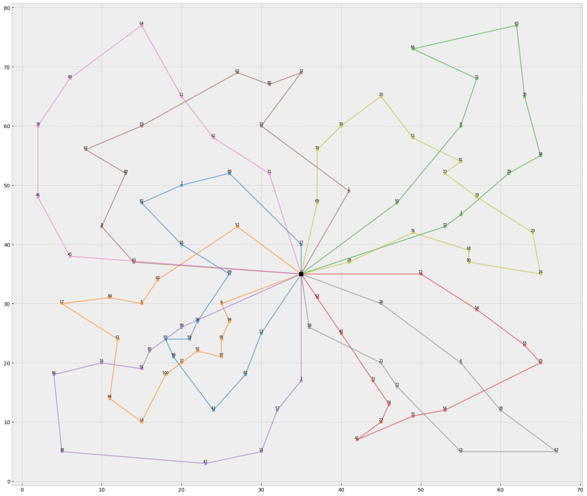

This week, I used bigger dataset, which contains 101 consumers and 8 trucks

# pyVRP
1. pyVRP needs much more generation to reach optimization
2. The pyVRP's convergence rate is too solw. Although the generation equals to 25000, we still can't get result (I also modify other parameters in GA, but still not effect)
3. generation = 2500, cost 1977.43 
4. generation = 5000, cost 1970.85 
5. generation = 25000, cost 1425.84

# VRPSolverEasy
1. Time: 11min
2. It is much faster than pyVRP
3. 