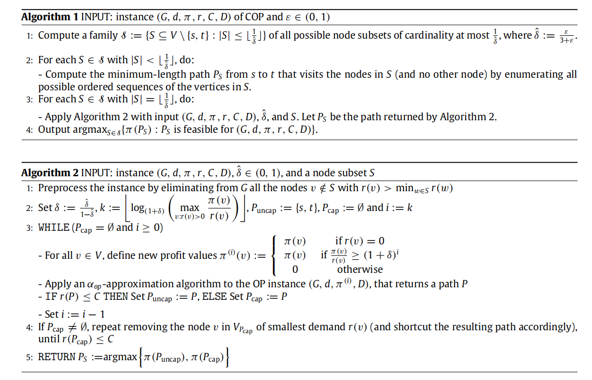
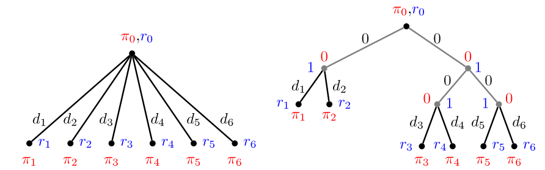
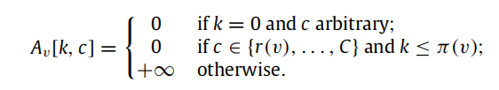
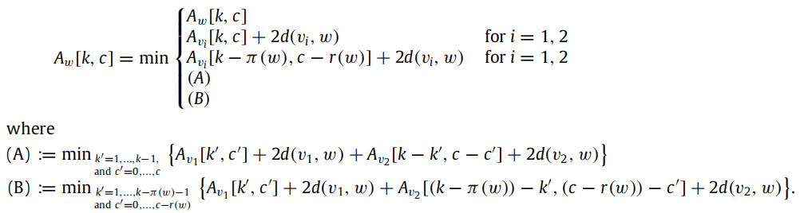
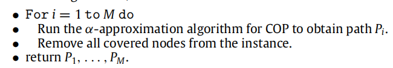

# 1. Capacited Orienteering Problem
1. Basic
   1. Undirected Graph: G(V,E)
      1. distance of each edge E: d
      2. profit of each node V: $\pi$
   2. want to find a s-t path P = ($V_p$, $E_p$)
      1. max $\sum_{v \in V_p} \pi(v)$
      2. constraint: 
         1. length: $\sum_{e \in E_p} d(e) \leq D$, D is a length bound 
         2. Demand: $\sum_{v \in V_p} r(v) \leq C$, C is a Capacity bound 
2. CTOP: we could use a fleet of M capacitated vechicles
3. SDCTOP:  is defined as CTOP but with the difference that a customer’s demand can be served by more than one vehicle (split delivery)
4. DVRP: minimum number of paths respecting both a length bound D and a capacity bound C that is necessary to serve all customer demands.

# 2. 3-$\epsilon$ approximation algorithm for general graphs
1. notation:
   1. W: any subset of nodes
   2. r(W) = $\sum_{v \in W} r(v)$ and $\pi(W) = \sum_{v \in W} \pi(v)$
   3. denote r($V_P$) and $\pi (V_P)$ with $r(P)$ and $\pi (P)$
   4. $\pi(v) > r(v)$ for each node
2. Alg: 
3. Property ($P^*$ is optimal solution)
   1. Alg1 is a $1+ \alpha_{op}+\epsilon$ approximation alg for COP ($0 < \epsilon < 1$)
   2. Out put from alg1 is feaseible and total profit $\geq (1+\alpha_{op}+\epsilon)^{-1} \pi(P^*)$
   3. alg1 and alg2 run in time polynomial in the size of the instance (G,d,$\pi$, r, C, D)

# 3. PTAS (polynomial time approximation scheme)
1. PTAS: given an instance of the problem and a value ε > 0, returns a feasible solution of value at least (1 − ε) times the value of an optimal solution. The running time is polynomial in the input size for any fixed constant ε.
2. FPTAS: the running time is polynomial in both the input size and $\frac{1}{\epsilon}$
3. Given a instance l = (G,d,π,r,C,D) of COP, we have properties
   1. if alg returns a feasible solution to the instance l whose the value is ar least $1 - \delta$ times the optimal value for every $\delta > 0$ and that runs in time polynomial in $|l|·\pi(V) · C$ for $\delta$ fixed. Then there is a PTAS for COP. 
   2. If alg runs in time polynomial in $|l|·\pi(V)$ and $\frac{1}{\delta}$, then there is an FPTAS for COP

# 4. PTAS for tree metrics
1. Given Tree T=(V,F) with node profits and demands, edge F weights d. We ask for a walk P between 2 node s and t in T that collects maximum profit from the nodes contained in P and satisfies both a length bound D and the capacity bound C
2. denote $n = |V|$ and $\Pi = \sum_{v \in V} \pi(v)$; any u,v $\in V$, denote the unique u-v path in T bt $P_{uv}$
3. Tree:
   1.  
   2. $A_v[k,c]$：
      1. the length of the shortest tour from v in the subtree below v that collects profit at least k using at most c units of capacity. k up to $\Pi$, c up to C. 
      2. Initial A: 
      3. update: for each node w, we collect the profit from its 2 children.We consider the tree rooted at s and compute table entries bottom up, i.e. the entry for a node w is computed as soon as the table entries for its two children v1 and v2 have been computed. 
4. Property
   1. COP on tree metrics can be solved in time $O(n\Pi^2 C^2)$
   2. FPTAS for OP on tree metrics
   3. PTAS for COP on tree metrics

# 5. Application of Alg
1.  (Split delivery) capacitated team orienteering
    1.  allows the use of M paths respecting both the capacity and the length bound. 
    2.  allow node demands to be served by several paths (SDCTOP):  Archetti et al.[2]
2.   Distance-constrained vehicle routing (with split-delivery)：DVRP
     1. The task is to find the smallest number of rooted tours such that each node is visited and both a length bound D ∈ N and a capacity bound C ∈ N is respected for each tour.
     2.  every node can only be served by exactly one vehicle.
     3.  Greedy alg: repeatedly searches for a feasible tour that respects both the capacity bound and the length bound until every demand node is satisfied.