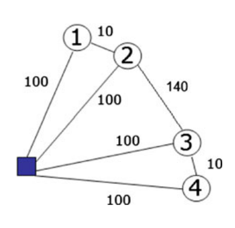
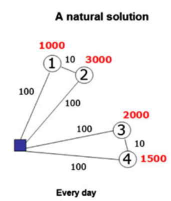
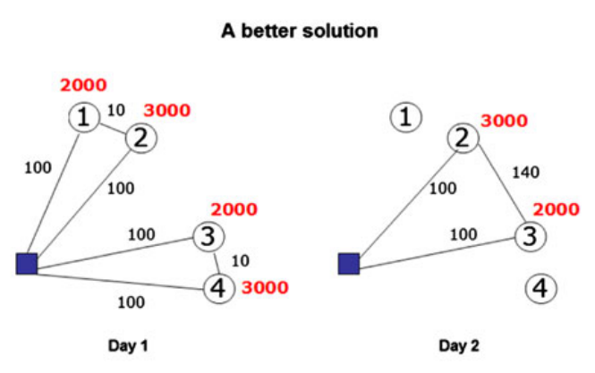

# 1. Basic problem:Bell et al. (1983)
1. Assumption
   1. inventory costs play no role; only consider how transportation cost impact our decision
   2. discrete time
2. Problem decription 
   1. 4 customer: $M = \{1,2,3,4\}$
   2. no limitation on the number of vehicles available, whose capacity is $C = 5000$
   3. edge with travel cost
   4. $q_s$: the daily demand of customer s, $s \in M$, is 1000,3000,2000,1500
   5. $U_s$: The maximum inventory level of customer s, $s \in M$, is 5000, 3000, 2000, 4000
   6. The initial inventory level of each customer s is equal to its maximum inventory level, $I_{s_0} = U_s$ for all $s \in M$
   7. customer and supplier all don't have invertory cost
   8. objective: min total transportation cost
   9. we need the periodic policy which implies the inverntory levels at the end of period must be equal to the initial levels
3. A natural solution 
   1. policy's period is 1 day
   2. customers 2 and 3 must be served every day because their maximum inventory level equals the daily demand
   3. 2 vehicles each day and average daily cost is 420
4. A better solution 
   1. period is 2 days
   2. policy:
      1. day1:  
         1. customers 1 and 2 are served together with one vehicle and 3 and 4 are served together with another vehicle
         2. A quantity 2,000 (twice the daily consumption) is delivered to 1, 3,000 (the daily consumption) to 2, 2,000 (the daily consumption) to 3 and 3,000 (twice the daily consumption) to 4.
      2. day2: customers 2 and 3 are served together in a tour, 3,000 is delivered to 2 and 2,000 to 3, while customers 1 and 4 are not visited
   3. average daily cost: 380

# 2. Managing distribution networks: IRP planning horizon,  the policies, the objectives, the decisions
1. IRP problem structure
   1. A set of products has to be shipped from the supplier to the customers to satisfy a deterministic demand over a time horizon that can be infinite or finite.
   2.  Shipments are performed by a fleet of vehicles having given capacity.
   3. cost 
      1. Inventory cost: are charged at the supplier and the customers
      2. transportation cost
2. possible shipping times of an IRP
   1. Continuous: shipment can be performed at any time
   2. Continuous with a minimum intershipment time: continuous but the  time between any pair of consecutive shipments (intershipment time) cannot be lower than a given minimum intershipment time
   3. Discrete: Shipments can be performed only at multiples of a minimum intershipment time. the minimum intershipment time can be normalized to 1 without loss of generality
   4. Let $z^*_C$, $z^*_M$, $z^*_D$ as the opytimal cost of the 3 above situation. If all the other characteristics of the problem are the same, $z^*_C \leq z^*_M \leq z^*_D$
   5. not imply that the model with continuous shipping times should always be preferred to the others
3. planning horizon
   1. Infinite:  the IRP aims at determining a long-term distribution plan that may be useful
   2. finite: The length of the planning horizon depends on the specific situation tackled. A short horizon is more operational than a long horizon.
4. Structured policies: get our optimal policy based on these structured polices
   1. Zero Inventory Ordering (ZIO): Any customer is replenished if and only if its inventory level is down to zero
   2. Periodic: A period P has to be found. Any operation performed at time t, $0 \leq t \leq P$, is repeated at times t + kP, k = 1, 2, ...
   3. Frequency-based
      1. These are periodic policies in which shipments are performed on the basis of one or several frequencies.
      2.  If more frequencies are allowed, then each frequency has an associated integer intershipment time and the period P of the policy is the minimum common multiplier of the intershipment times.
   4. Full load: Shipments are performed using full load vehicles only
   5. Direct shipping:
      1. Any customer is served independently by direct shipments from the supplier only
      2. Routes that visit more than one customer are not allowed.
   6. Order-up-to level
      1. Any customer has defined a maximum inventory level.
      2. Every time a customer is served, the delivered quantity is such that the maximum inventory level at the customer is reached.
   7. Maximum level:
      1. Any customer has defined a maximum inventory level.
      2. Every time a customer is served, the delivered quantity is such that the inventory level at the customer is not greater than the maximum level.
   8. Fixed partition
      1. The set of customers is partitioned into a number of sets such that each set is served separately and independently of the other sets. (typically based on geographical location to partition)
      2. any route visits customers of the same set
   9.  Partition-based: like fixed partition, A route may visit customers of a set only, but also customers of specific combinations of two or more sets.
5. objectives
   1. objective of minimizing the sum of the inventory and transportation costs is more suitable than the minimization of only one of the two cost components whenever a decision-maker is responsible for all the cost components.
6. Decision
   1. Retailer Managed Inventory (RMI):
      1.  If the customers of a supplier, independently of each other and independently of the supplier, decide when and how much to order, the problems to be solved by the supplier over time are vehicle routing problems.
      2.   the power of the supplier to optimize the distribution is strongly constrained by the decisions taken by the customers
    2. Vendor Managed Inventory（VMI）
       1.  the supplier has the power of deciding times and quantities of the deliveries. 
       2.  it has the responsibility to avoid a stock-out at the retailers
   2.  In inventory management
       1.  **over space**: the decision concern the  the routes of the vehicles
       2.  **over time**：decisions concern the timing and the quantities of the orders
   3.  Decision spaces in IRP
       1.  Decisions over time only
           1.  routes are given
           2.  The decisions concern the times and the quantities to deliver to the customers
       2.  Decisions over time and space
           1.  The timing of the deliveries to each customer, the quantities to be delivered each time a delivery takes place and the routes traveled by the vehicles have to be decided at the same time.

# 3. main models for IRPs where the routing part has no role
1. Decisions over time only: the Single Link Shipping Problem
   1. a supplier serves one customer only and, thus, the route traversed by the vehicles is given, from the supplier to the customer and back.
   2. problem description
      1. product: $i \in I$ from supplier A to customer B. 
      2. Each product will be made at the supplier and absorbed at customer at a constant rate $q_i$
      3. unit volume of i: $v_i$; 
      4. unit inventory cost per time unit: $h_i$
      5. total volume produced per time: $v = \sum_{i \in I} v_iq_i$
      6.  total inventory cost per time unit$h = \sum_{i \in I} h_iq_i$
      7.  supplier and customer's inventory level must be non negative
      8.  vehicle capacity: C (normalized to 1, without loss of generality)
      9.  vehicle transportation cost(independent to the quantity loaded): c
      10. objective: min the sum of the average transportation and inventory costs per time unit
   3.  periodic policy: 
       1.  inventory level of starting time(t=0): $d_i^A$, $d_i^B$ for supplier and customer
       2.  the quantity $s_{it'} = s_{it}$ is shipped for any time t and $t'$. $t' = kP+t$, k is an integer >0; P is the period
       3.  the number of vechicles $y_t$ to use at any time t
       4.  the products are shipped every $\tau$ times ($\tau$ is an integer)
       5.  single frequency policy
           1.  $P = \tau$
           2.  $d_i^A = q_i \tau$
           3.  $d_i^B = 0$
           4.  $s_{i0} = q_i \tau$
           5.  $s_{it} = 0$, t = 1,2,...,P-1
           6.  $y_0 = \lceil v\tau \rceil$; $y_t$ = 0 for t = 1, 2, ..., P-1
           7.  average cost per time unit: $h\tau + \frac{c}{\tau} * \lceil v\tau \rceil$
           8.  we assume that the total inventory level at any time t is $d_i^A + d_i^B$
       6.  continuous time
           1.  property: In the optimal periodic policy of the continuous case, the products are shipped at a single frequency, using a single vehicle.
               1.  $\bar{P}$ is the period and $\bar{\tau}$ is the maximum intershipment time. In the period, we have used m vehicles in this period 
               2.  no shipment in a time interval of length $\bar{\tau}$, therefore we have at least $\sum_i q_i\bar{\tau}$ at every beginning of an interval
               3.  the total inventory cost per time unit is at least $\sum_i h_iq_i\bar{\tau} = h\bar{\tau}$
               4.  To minimize total inventory cost, we should minimize intershipment time. We use m vehicles totally in this period, therefore, the single frequency policy with intershipment time $\tau = \frac{\bar{P}}{\bar{m}}$
               5.  That is why we say 
           2.  
2. Decisions over time only: the Inventory Routing Problem with Direct Shipping
   1.  a supplier serves a set of customers with direct shipments to each separately. Again, the routes are fixed.
   2.  some paper to read
       1.  Gallego and Simchi-Levi (1990): continuous shipping times. There are some extensions: Hall (1992), Gallego and Simchi-Levi (1994) and Jones and Qian (1997)
       2.  Bertazzi (2008) :  direct shipping policies where each link is optimized independently, for the case with discrete shipping times