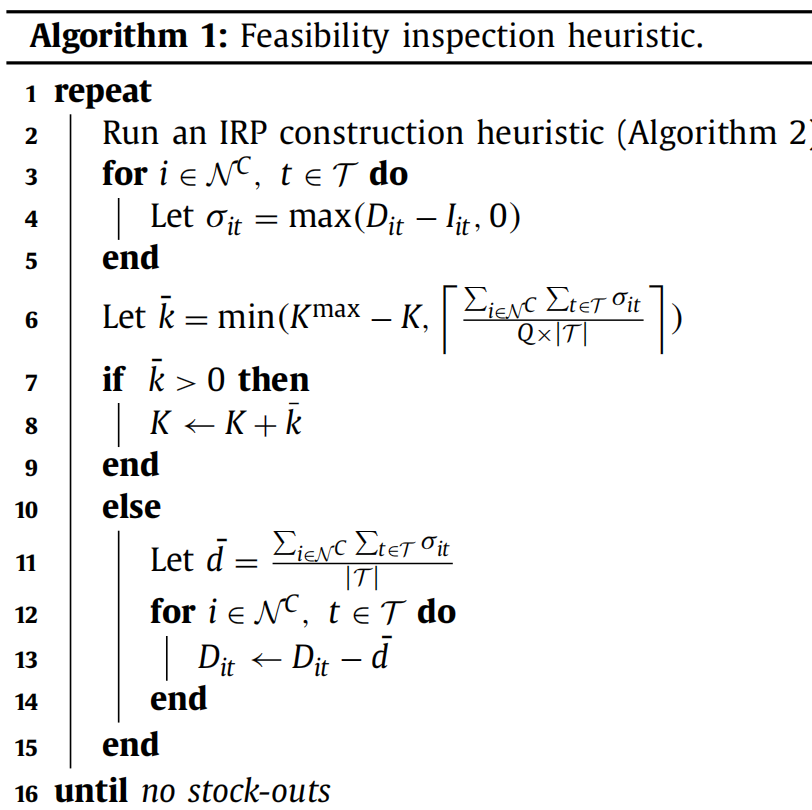

# 1. Introduction
1. small benchmark and large benchmark: Archetti et.al (2007) and Archetti et al. (2012)
2. IRP exact method:
   1. Branch-cut-and-price algorithms: Desaulniers, Rakke, & Coelho, 2016
   2. brach-and-cut algorithms: most popular. There are many paper of this alg
3. new benchmark:
   1. add time-varying demans and longer palnning horizons
   2. non stationary demands: customer does not necessarily have the same demands in every time period of the palnning horizon
   3. routes become shorter
   4. higher variance of the inventory capacity of the customers
   5. depot inventory has explicit upper bound
   6. node locations have different structure: random(R), cluster(C) and mix (R&C)
      1. large city/counrtyside: R
      2. small towns: C
      3. combination: RC
   7. assumption of economies of scale for the inventories
   8. analyze and compared with the original benchmark instance through an instance space analysis with MATILDA

# 2. Instance generation
1. Vehicle fleet 
2. Demand
   1. random vary each time period, positively correlated between customers operating within the same sector
      1. trajectory demand: customers' demand has a trend, for example, at beginning of the week, the demand increases, middle, decreases; and the end of week, increase again
   2. We create a demand trajectory and give it random deviations for different customers
   3. build the mean demand trajectory $\bar{D}_{it}$ with sine function. $\bar{D}_{it} = B_iK_isin(\theta_i t + \phi_i) + K_i$, all coefficients are followed uniform distribution
      1. customer: $i \in N^C$
      2. time period: $t \in \Tau$
      3. peak demand coefficient: $B_i$
      4. average demand of item i: $K_i$
      5. frequency between each peak demand: $\theta_i$
      6. shift coefficient, define where is the first period on the trajectory: $\phi_i$
   4. construct exact demand based on trajectory 
      1. given mean demand $\bar{D}_{it}$ and relative symmetric support $\alpha$ from the interval [0,1]
      2. if $\bar{D}_{it} = 10$, $\alpha = 0.2$, we will get upper support 12 and lower support 8
3. production rate in the depot: $S_t$ 
   1. constant
   2. $S_t = \lceil \sum_{i \in N^C} \sum_{t \in \Tau} D_{it}/|\Tau| \rceil$，$t \in \Tau$
4. Inventory
   1. determine the inventory capacity by selecting a minimum visiting frequency, F
   2. $F \in [1, |T|]$, T is the total period
   3. consumer capacity: $I_i = \lceil \max\{\max_{t \in \Tau}\{D_{it}\}, \sum_{t \in \Tau} D_{it}/F\} \rceil$
      1. In the case that the visiting frequency of a customer is equal to one, we set its inventory capacity equal to its total demand over the planning horizon
      2. Conversely, if the visiting frequency is equal to |T|, the inventory capacity is set equal to the maximum demand incurred over the planning horizon.
   4. supplier capacity:
      1. draw the inventory capacity at the depot from a uniform distribution with the following support: [$\max{S_t, \max_{i \in N^C}{\sum_{t \in \Tau}}}$， $\sum_{i \in N^C}\sum_{t \in \Tau}{D_{it}}$]
   5. initial customer inventory: [0, $\min_{i\in N^C}{\{D_{i1}+D_{i2}, \bar{L}_i\}}$], $\bar{L}_i$ is the maximum storage capacity
      1. We use the demand of the first two periods as an upper limit to not make the first part of the planning horizon trivial to solve.
   6. initial depot inventory：[$\sum_{i \in N^C}D_{i0}$，$\min_{i\in N^C}{\{S_1+S_2, \bar{L}_0\}}$]
      1. $\sum_{i \in N^C}D_{i0}$ in order to guarantee that the first-period deliveries are feasible
   7. assume the depot has the smallest inventory cost due to economies of scale
   8. assume the customers then have a marginal inventory cost increase relative to the depot. The customers’ marginal inventory cost per unit of product per time period is drawn from a uniform distribution with the support [0.0, 0.3].
5. Node locations
   1. Random: draw the customers' coordinates from a uniform distribution
   2. Cluster: draw the cluster's center from a uniform distribution; customer's coordinates are determined by drawing an angle and a radius from the cluster center
      1. angle: drawn from a uniform distribution
      2. radius: drawn from $p(x|\lambda) = \lambda e^{-\lambda r}$. Higher $\lambda$ means customers are closer to the cluster center
   3. RC: 50% of the customers are locasted with random method and remaining are located with the cluster
   4. Matrix:
      1. distance: $E_{ij} = \sqrt{(y_j-y_i)^2 + (x_j-x_i)}$
      2. cost
         1. urban: $C_{ij}^{urban} = \rfloor 0.1E_{ij} + 1\rfloor$
         2. rural: $C_{ij}^{rural} = \rfloor 0.5E_{ij} + 1\rfloor$
6. Feasibility inspection heuristic
   1. $I_{it} = \max{I_i - \sum_{s=0}^t D_{is}, 0}$
   2. K: fleet size
   3. $\bar{k}$: the number of vehicles chosen
   4. Q: each vehicles' capacity
   5. stock out value: $\sigma_{it}$
   6.    
   7.  consturction heuristic for IRP
       1.  2 types of customers: 
           1.  urgent customers: $N_t^{UC}$. The remaining inventory level is not sufficient to cover the demand $D_{it}$
           2.  non-urgent customers: $N_t^{NUC}$
       2.  quantity $q_{it}$ delivered to customer i on day t is the minimum between:
           1.  the maximum quantity that can be delivered without exceeding the maimum inventory capacity $\bar{L}_i$
           2.  the highest avaliable vehicle's residual capacity
           3.  the quantity $I_{0,t}$ avaliable at the supplier

# 3. Instance overview:
 

# 4. Model
1.  
2. $x_{ijt}$：if in period t, the vehicle traverse arc (i,j), equals to 1
3. $\delta_{it}$: denote the number of times node i is visited in time period t (binary)
4. non negetive variable $s_{it}$ represent the inventory level of node i in time t
5. $q_{it}$: quantity delivered to the customer i in time period t

# 5. Solution methods
1. Branch and cut
   1. MILP define by the formulation (7)-(15) and (18)-(21)
   2. constraints (16) and (17) are added dynamically at every node of the Branch-Brand tree
   3. alg: Skålnes et al. (2022) and Avella et al. (2018).
2. Matheuristic
   1. Archetti et al. (2017): has been successful for the original benchmark instances of the IRP
   2. a construction phase: generate a starting solution and relies on a relaxation of an exact MILP formulation. Then, use Lin-Kernighan alg to derive vehicle routes
   3. a tabu search algorithm：looks for an enhanced solution to the IRP within the neighborhood of the starting solution.
   4. an improvement phase：incorporates information collected during the tabu search and attempts to fix the values of certain variables to zero. The MILP formulation becomes easier to solve, and it is rerun to obtain a new solution.